## Алгоритмы

### Полезные материалы
1. [RoadMap на YouTube](https://www.youtube.com/watch?v=JjsSssoVZD8)

### RoadMap
#### Асимптотический анализ
1. Верхняя оценка (О большое)
2. Средняя оценка (омега)
3. Нижняя оценка (тетта)

#### Базовые структуры данных
1. Массив
2. Список/Двусвязный список 
3. Дерево 
4. Хэш таблица 
5. Бинарная куча 
6. Очередь/Стек/Двухсторонняя очередь 
7. Граф

#### Бинарный поиск
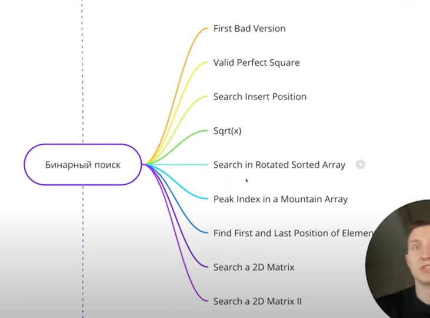

#### Два указателя
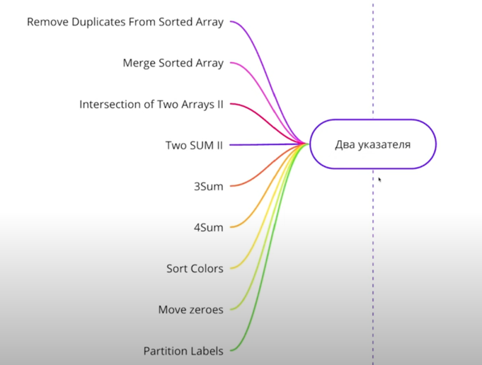

#### Строки
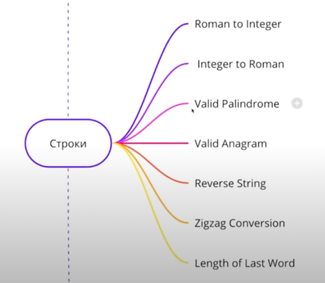

#### Связные списки
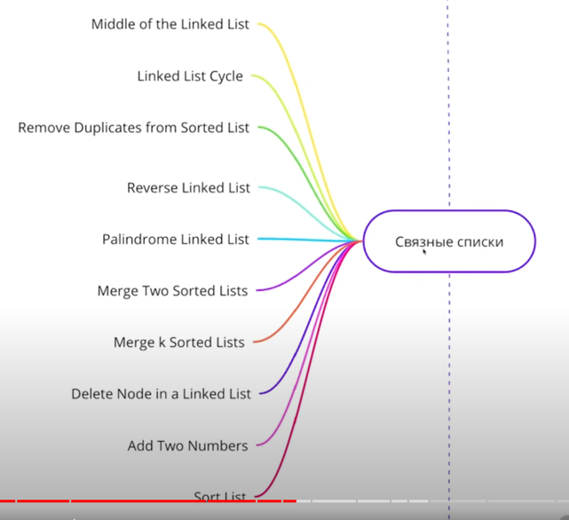

#### Деревья
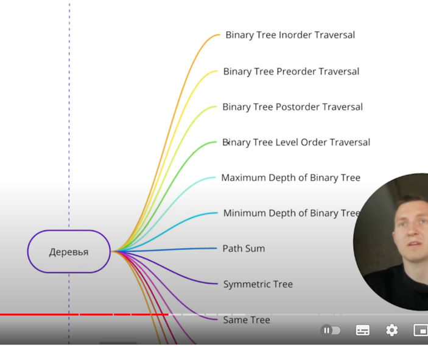
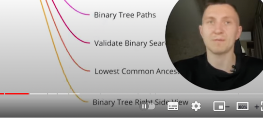

#### Хэш таблицы
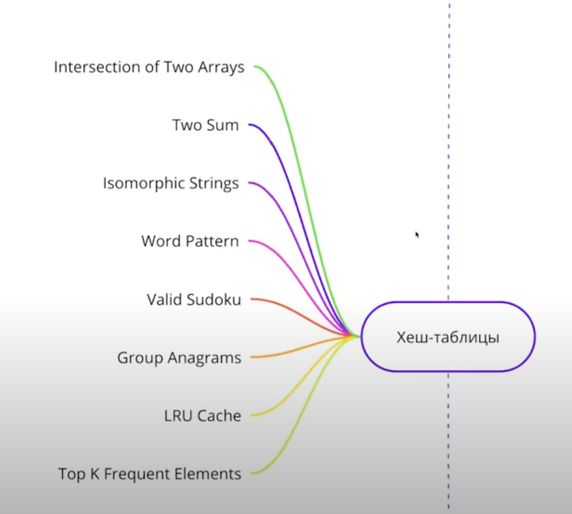

#### Матрицы
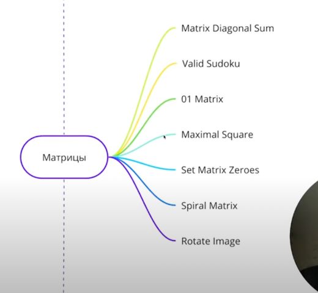

#### Очередь и стек
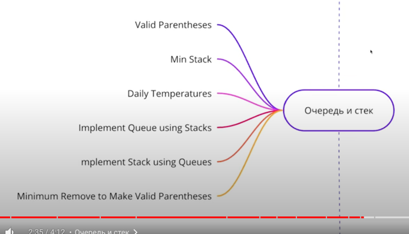

#### Битовые манипуляции
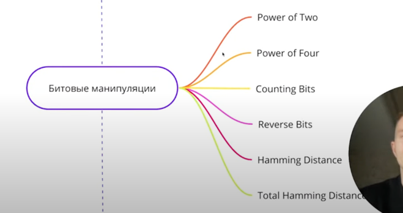

#### Скользящие окна
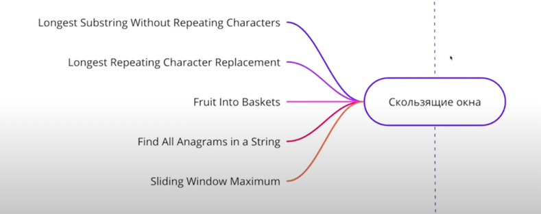

#### Поиск с возвратами
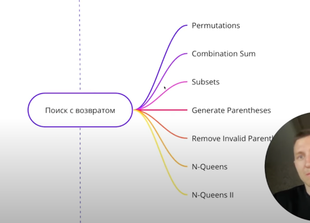

#### Дополнительно
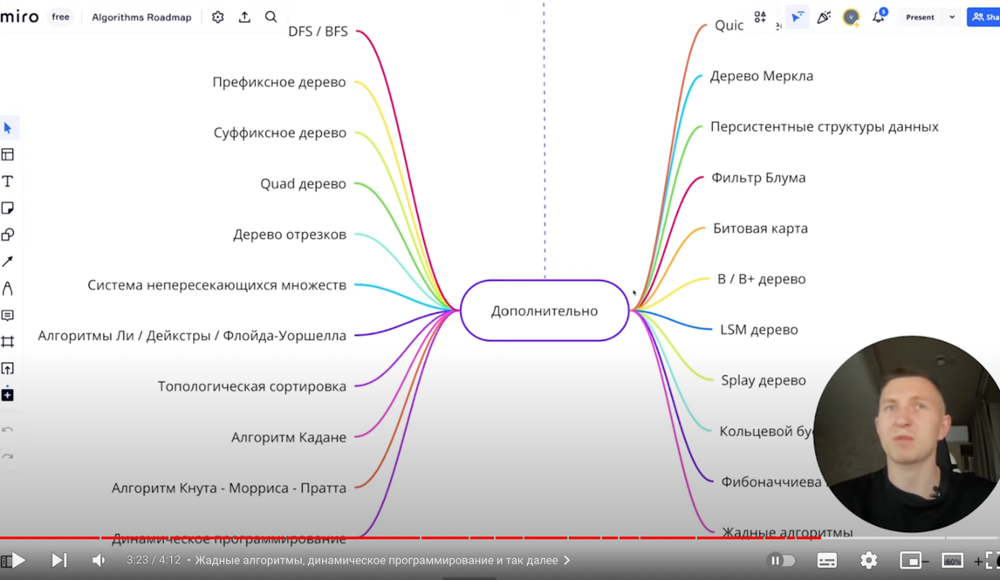

